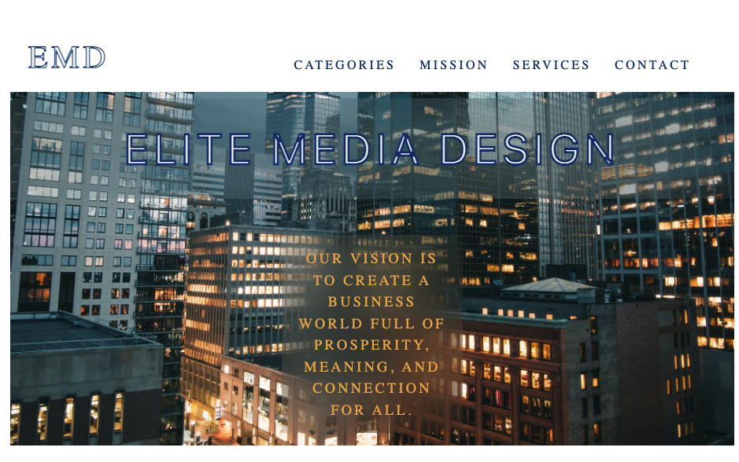

### Title \*\*\*\*

** Elite Media Design **

## Description \*\*\*

Elite Media Design is a functional design
firm landing page. This is a application
to showcase a few of my skills to employers.
I am using SASS and UI Kit on the front end to
make components responsive and aestetic. The requirements
for the project ensured I use the relevant colors and
font family for the project.

## Table of Contents \*\*\*\*

- [Installation Instructions](##Installation_Instructions)
- [Usage Information](##Usage_Information)
- [Contribution Guidlines](##Contribution_Guidlines)
- [License](##License)
- [Project Links](##Project_Links)

## Installation_Instructions \*\*\*

     npm i
     npm run compile:sass

## Usage_Information \*\*\*

     A user can browse several components of
     the webpage to view information relevant to
     Elite Media Design and their values. An
     additional categories page can be seen to view
     an API call to mealsDB.

## Credits

     - W3schools
     - MealsDB API
     - Google Fonts
     - UI Kit (the best css Library!)

## Contribution_Guidlines \*\*\*

     Feel free to fork the repo and
     make make a pull request to my branch.
     I would love to collaborate!

## Questions

- If you have any questions, feel free to reach out to me by email.
  grantjoslyn@gmail.com

### GitHub Username \*\*\*

    Josly025

## License \*\*\*

    (https://opensource.org/licenses/MIT)

## Project_Links \*\*\*

[GitHub Repo](https://github.com/Josly025/elite_media_design.io.git)

[Deployed Link](https://wizardly-einstein-1e3b09.netlify.app)
